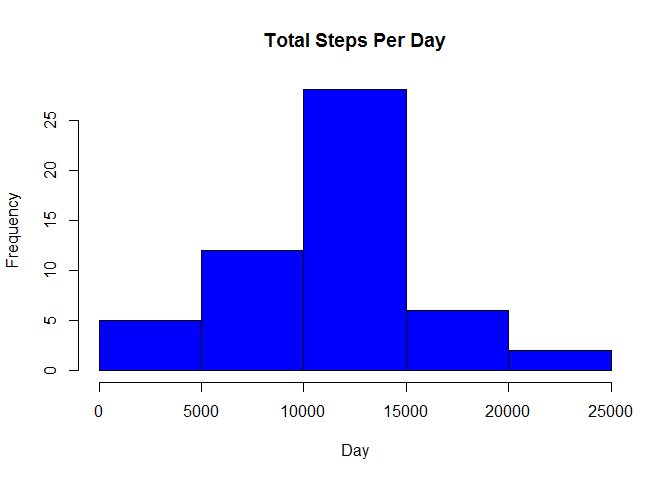

# Reproducible Research: Peer Assessment 1


## Loading and preprocessing the data

1 Read the csv file into "activity" with proper column classes , put wrapper around date column as.Date

2 add a "day" column to denote day of the week


```r
unzip("activity.zip", "activity.csv")
activity <- read.csv("activity.csv", colClasses = c("numeric", "character", "numeric"))
library(lubridate)
activity$date <- as.Date(activity$date, "%Y-%m-%d")
activity$day <- wday(activity$date, label = TRUE)
```

## What is mean total number of steps taken per day?

Use aggregate() function to save aggregated dataset with a dependent variable steps, independent variable  days, data activity.csv, and FUN = sum. Then do the same for  and median.  Plot the sum histogram.


```r
aggregate_sum <- aggregate(steps ~ date, data = activity, FUN = sum, na.rm = TRUE)

hist(aggregate_sum$steps, main = "Total Steps Per Day", xlab = "Day", col = "Blue")
```

 

The Mean and Median are

###Mean

```r
mean(aggregate_sum$steps)
```

```
## [1] 10766.19
```

###Median

```r
median(aggregate_sum$steps)
```

```
## [1] 10765
```


## What is the average daily activity pattern?

Make a time series : steps and interval


```r
time_series <- tapply(activity$steps, activity$interval, mean, na.rm = TRUE)
```

plot the series


```r
plot(row.names(time_series), time_series, type = "l", xlab = "5-min interval", 
    ylab = "Average across all Days", main = "Average number of steps taken", 
    col = "red")
```

 

Find the MAX interval across all days 


```r
max_steps <- which.max(time_series)
names(max_steps)
```

```
## [1] "835"
```

## Imputing missing values

Find the total number of missing values


```r
Rows_NA <- sum(is.na(activity))
Rows_NA
```

```
## [1] 2304
```

Use avg steps to fill in NA values in the steps column


```r
StepsAvg <- aggregate(steps ~ interval, data = activity, FUN = mean)
fillNA <- numeric()
for (i in 1:nrow(activity)) {
    obs <- activity[i, ]
    if (is.na(obs$steps)) {
        steps <- subset(StepsAvg, interval == obs$interval)$steps
    } else {
        steps <- obs$steps
    }
    fillNA <- c(fillNA, steps)
}
```
Create a new dataset with NA values filled replaced


```r
new_activity <- activity
new_activity$steps <- fillNA
```

Recalculate the total number of steps each day, and report the mean , median and graph a histogram of daily steps


```r
aggregate_sumNew <-  aggregate(steps ~ date, data = new_activity, sum, na.rm = TRUE)
```

The Histogram :

```r
hist(aggregate_sumNew$steps, main = "Total steps by day", xlab = "day", col = "blue")
```

 

### Mean


```r
mean(aggregate_sumNew$steps)
```

```
## [1] 10766.19
```

###Median


```r
median(aggregate_sumNew$steps)
```

```
## [1] 10766.19
```

```r
## Are there differences in activity patterns between weekdays and weekends?
```
